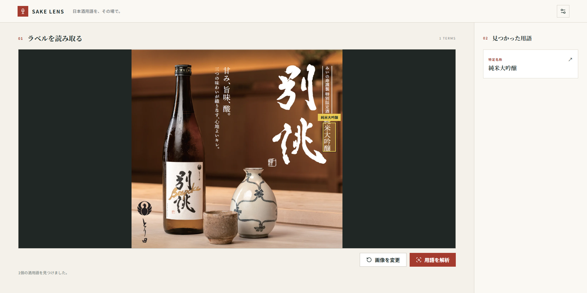

# SAKE LENS

日本酒の写真にある「わからない言葉」を、その場で理解するためのWebアプリです。ラベルや広告画像から酒用語を見つけ、画像上のボタンを押すと説明が開きます。さらに気になることを、チャットで続けて質問できます。

## 5W1H

| 観点 | 内容 |
| --- | --- |
| Who / 誰のために | 日本酒に馴染みがなく、「純米」「吟醸」「生酒」などの言葉で迷う人 |
| What / 何をする | 写真の中の日本酒用語を見つけ、説明と対話で理解を助ける |
| Why / なぜ | 専門用語を調べる負担を減らし、日本酒に親しむきっかけをつくるため |
| When / いつ | 酒屋でラベルを読むとき、飲む前に特徴を知りたいとき、広告画像を見て疑問が浮かんだとき |
| Where / どこで | ローカルで起動したアプリにアクセスできるブラウザ上。外出先での利用には別途アクセス環境が必要 |
| How / どうやって | 画像を選択して解析し、検出された用語のボタンを押し、説明を読んで追加質問する |

## できること

- 日本酒のラベルや広告などの画像を選択して文字を解析する。
- 横書きに加え、縦書きや背景上の白い文字も解析する。
- 検出した酒用語を画像上の位置と一覧から選ぶ。
- 用語の意味をAIに説明してもらう。
- 「ほかの種類と何が違う？」「冷やして飲むの？」など、その用語について続けて質問する。

画像の文字認識はブラウザ内、回答の生成はDocker内のローカルAIで行います。画像自体を外部AIサービスへ送る処理はありません。回答には誤りが含まれる場合があります。

## 使い方

右上の設定から説明・チャットの言語と、普段飲んでいるお酒を登録できます。初期言語は日本語です。お酒を登録すると、最初の説明に馴染みのお酒との比較を加えるようAIに伝えます。設定はブラウザに保存されます。

1. 「画像を選ぶ」から写真を選択します。
2. 「用語を解析」を押します。
3. 画像上のボタン、または「見つかった用語」から知りたい言葉を選びます。
4. 表示された説明を読み、気になることを入力して送信します。

画像を用意せずに画面を試す場合は「サンプルで試す」を選べます。チャットの履歴は画面を閉じると消えます。